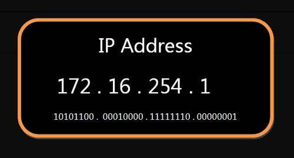

js html css知识点
=========
1. :nth-last-child(n)选择器匹配属于其元素的第 N 个子元素的每个元素，不论元素的类型，从最后一个子元素开始计数。n 可以是数字、关键词或公式。
	p:nth-last-child(2)
	{
	background:#ff0000;
	}
    //规定属于其父元素的第二个子元素的每个 p 元素，从最后一个子元素开始计数(！！！不管最后一个子元素是不是p元素！！！）

互联网协议
=========
1. 五层模型：实体层、链接层、网络层、传输层、应用层
	
2. 互联网的核心是一系列协议，总称为"互联网协议"（Internet Protocol Suite），它们是互联网的核心
3. 实体层：它就是把电脑连接起来的物理手段。它主要规定了网络的一些电气特性，作用是负责传送0和1的电信号。
4. 链接层：单纯的0和1没有任何意义，必须规定解读方式：多少个电信号算一组？每个信号位有何意义？这就是"链接层"的功能，它在"实体层"的上方，确定了0和1的分组方式。
	1. 以太网协议，一组电信号构成一个数据包，叫做‘帧’（Frame）。每一帧分成两个部分：标头（Head）和数据（Data)。"标头"包含数据包的一些说明项，比如发送者、接受者、数据类型等   等；"数据"则是数据包的具体内容。
	2. 每块网卡出厂的时候，都有一个全世界独一无二的MAC地址，长度是48个二进制位，通常用12个十六进制数表示。
	
5. 网络层：它的作用是引进一套新的地址，使得我们能够区分不同的计算机是否属于同一个子网络。这套地址就叫做"网络地址"，简称"网址"。"网络层"出现以后，每台计算机有了两种地址，一种是MAC地址，另一种是网络地址。两种地址之间没有任何联系，MAC地址是绑定在网卡上的，网络地址则是管理员分配的，它们只是随机组合在一起。
	1. IP协议
		- IP协议，广泛采用的是IP协议第四版，简称IPv4。这个版本规定，网络地址由32个二进制位组成。这个地址分成两个部分，前一部分代表网络，后一部分代表主机。两个部分的长度并不固定，需要通过“子网掩码”来确定网络地址长度进而判断是否属于同一个子网络。
		
		- 子网掩码，它在形式上等同于IP地址，也是一个32位二进制数字，它的网络部分全部为1，主机部分全部为0。
		- 知道"子网掩码"，我们就能判断，任意两个IP地址是否处在同一个子网络。方法是将两个IP地址与子网掩码分别进行AND运算（两个数位都为1，运算结果为1，否则为0），然后比较结果是否相同，如果是的话，就表明它们在同一个子网络中，否则就不是。
		- IP协议的作用主要有两个，一个是为每一台计算机分配IP地址，另一个是确定哪些地址在同一个子网络。
	2. IP数据包
		- IP数据包，根据IP协议发送的数据，包括IP地址信息，也分为"标头"和"数据"两个部分。
		- 我们可以把IP数据包直接放进以太网数据包的"数据"部分，因此完全不用修改以太网的规格。这就是互联网分层结构的好处：上层的变动完全不涉及下层的结构。
	3. ARP协议
		- 我们需要一种机制，能够从IP地址得到MAC地址。
		- 如果两台主机不在同一个子网络，那么事实上没有办法得到对方的MAC地址，只能把数据包传送到两个子网络连接处的"网关"（gateway），让网关去处理。
		- 如果两台主机在同一个子网络，那么我们可以用ARP协议，得到对方的MAC地址。
		- ARP协议也是发出一个数据包（包含在以太网数据包中），其中包含它所要查询主机的IP地址，在对方的MAC地址这一栏，填的是FF:FF:FF:FF:FF:FF，表示这是一个"广播"地址。它所在子网络的每一台主机，都会收到这个数据包，从中取出IP地址，与自身的IP地址进行比较。如果两者相同，都做出回复，向对方报告自己的MAC地址，否则就丢弃这个包。
		- 总之，有了ARP协议之后，我们就可以得到同一个子网络内的主机MAC地址，可以把数据包发送到任意一台主机之上了。
6. 传输层：我们还需要一个参数，表示这个数据包到底供哪个程序（进程）使用。这个参数就叫做"端口"（port），它其实是每一个使用网卡的程序的编号。每个数据包都发到主机的特定端口，所以不同的程序就能取到自己所需要的数据。"传输层"的功能，就是建立"端口到端口"的通信。相比之下，"网络层"的功能是建立"主机到主机"的通信。只要确定主机和端口，我们就能实现程序之间的交流。
	1. UDP协议：现在，我们必须在数据包中加入端口信息，这就需要新的协议。最简单的实现叫做UDP协议，它的格式几乎就是在数据前面，加上端口号。
	2. UDP数据包：由"标头"和"数据"两部分组成。
		- "标头"部分主要定义了发出端口和接收端口，"数据"部分就是具体的内容。然后，把整个UDP数据包放入IP数据包的"数据"部分，而前面说过，IP数据包又是放在以太网数据包之中的
		- UDP数据包非常简单，"标头"部分一共只有8个字节，总长度不超过65,535字节，正好放进一个IP数据包。
		- UDP协议的优点是比较简单，容易实现，但是缺点是可靠性较差，一旦数据包发出，无法知道对方是否收到。
	3. TCP协议：这个协议非常复杂，但可以近似认为，它就是有确认机制的UDP协议，每发出一个数据包都要求确认。如果有一个数据包遗失，就收不到确认，发出方就知道有必要重发这个数据包了。
	4. TCP数据包：TCP数据包和UDP数据包一样，都是内嵌在IP数据包的"数据"部分。TCP数据包没有长度限制，理论上可以无限长，但是为了保证网络的效率，通常TCP数据包的长度不会超过IP数据包的长度，以确保单个TCP数据包不必再分割。
7. 应用层：应用程序收到"传输层"的数据，接下来就要进行解读。"应用层"的作用，就是规定应用程序的数据格式。
	1. 举例来说，TCP协议可以为各种各样的程序传递数据，比如Email、WWW、FTP等等。那么，必须有不同协议规定电子邮件、网页、FTP数据的格式，这些应用程序协议就构成了"应用层"。这是最高的一层，直接面对用户。它的数据就放在TCP数据包的"数据"部分。因此，现在的以太网的数据包就变成下面这样。
	
8. 一个小结
	1. 我们已经知道，网络通信就是交换数据包。电脑A向电脑B发送一个数据包，后者收到了，回复一个数据包，从而实现两台电脑之间的通信。发送这个包，需要知道两个地址：对方的MAC地址、对方的IP地址。
	2. 有了这两个地址，数据包才能准确送到接收者手中。但是，前面说过，MAC地址有局限性，如果两台电脑不在同一个子网络，就无法知道对方的MAC地址，必须通过网关（gateway）转发。
	
	上图中，1号电脑要向4号电脑发送一个数据包。它先判断4号电脑是否在同一个子网络，结果发现不是（后文介绍判断方法），于是就把这个数据包发到网关A。网关A通过路由协议，发现4号电脑位于子网络B，又把数据包发给网关B，网关B再转发到4号电脑。
	所以，数据包的目标地址，实际上分成两种情况：

	| 场景 | 数据包地址|
	|----|:------|
	|同一个子网络 | 对方的MAC地址，对方的IP地址 | 
	|非同一个子网络 | 网关的MAC地址，对方的IP地址|  
9. 用户的上网设置
	1. 静态IP地址
		- 如果要上网需要知道四个参数：本机的IP地址、子网掩码、网管的IP地址、DNS的IP地址。由于它们是给定的，计算机每次开机，都会分到同样的IP地址，所以这种情况被称作"静态IP地址上网"。
		- 但是，这样的设置很专业，普通用户望而生畏，而且如果一台电脑的IP地址保持不变，其他电脑就不能使用这个地址，不够灵活。出于这两个原因，大多数用户使用"动态IP地址上网"。
	2. 动态IP地址
		- 所谓"动态IP地址"，指计算机开机后，会自动分配到一个IP地址，不用人为设定。它使用的协议叫做DHCP协议。
	3. DHCP协议
		- 这个协议规定，每一个子网络中，有一台计算机负责管理本网络的所有IP地址，它叫做"DHCP服务器"。新的计算机加入网络，必须向"DHCP服务器"发送一个"DHCP请求"数据包，申请IP地址和相关的网络参数。
		- 首先，它是一种应用层协议，建立在UDP协议之上，所以整个数据包是这样的：
		
			1. 最前面的"以太网标头"，设置发出方（本机）的MAC地址和接收方（DHCP服务器）的MAC地址。前者就是本机网卡的MAC地址，后者这时不知道，就填入一个广播地址：FF-FF-FF-FF-FF-FF。
			2. 后面的"IP标头"，设置发出方的IP地址和接收方的IP地址。这时，对于这两者，本机都不知道。于是，发出方的IP地址就设为0.0.0.0，接收方的IP地址设为255.255.255.255。
			3. 最后的"UDP标头"，设置发出方的端口和接收方的端口。这一部分是DHCP协议规定好的，发出方是68端口，接收方是67端口。
		- 以太网是广播发送，同一个子网络的每台计算机都收到了这个包。当看到发出方IP地址是0.0.0.0，接收方是255.255.255.255，于是DHCP服务器知道"这个包是发给我的"，而其他计算机就可以丢弃这个包。
		- DHCP服务器读出这个包的数据内容，分配好IP地址，发送回去一个"DHCP响应"数据包。这个响应包的结构也是类似的，以太网标头的MAC地址是双方的网卡地址，IP标头的IP地址是DHCP服务器的IP地址（发出方）和255.255.255.255（接收方），UDP标头的端口是67（发出方）和68（接收方），分配给请求端的IP地址和本网络的具体参数(IP地址、子网掩码、网关地址、DNS服务器)则包含在Data部分
10. DNS协议
	1. 我们知道，发送数据包，必须要知道对方的IP地址。但是，现在，我们只知道[网址]www.google.com，不知道它的IP地址。DNS协议可以帮助我们，将这个网址转换成IP地址。
	
	然后，DNS服务器做出响应，告诉我们Google的IP地址是172.194.72.105。于是，我们知道了对方的IP地址。

vue
=========
1. 更抽象一点来看，我们可以把组件区分为两类：一类是偏视图表现的 (presentational)，一类则是偏逻辑的 (logical)。我们推荐在前者中使用模板，在后者中使用 JSX 或渲染函数。
2. 一般来说，v-if 有更高的切换开销，而 v-show 有更高的初始渲染开销。因此，如果需要非常频繁地切换，则使用 v-show 较好；如果在运行时条件很少改变，则使用 v-if 较好。
3. 请注意修饰键与常规按键不同，在和 keyup 事件一起用时，事件触发时修饰键必须处于按下状态。换句话说，只有在按住 ctrl 的情况下释放其它按键，才能触发keyup.ctrl。而单单释放 ctrl 也不会触发事件。
4. 注意确保在初始化根实例之前注册组件
5. HTML 特性是不区分大小写的。所以，当使用的不是字符串模板时，camelCase (驼峰式命名) 的 prop 需要转换为相对应的 kebab-case (短横线分隔式命名)：
6. 注意在 JavaScript 中对象和数组是引用类型，指向同一个内存空间，如果 prop 是一个对象或数组，在子组件内部改变它会影响父组件的状态。
7. Vue 组件的 API 来自三部分——prop、事件和插槽